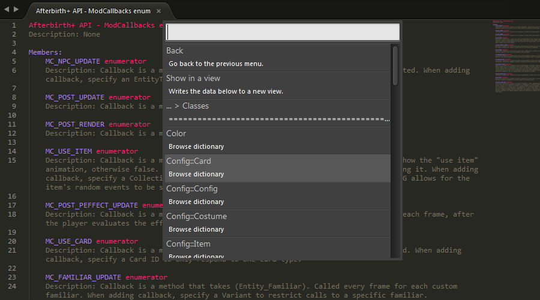

**The Subliming of Isaac**
==

A Sublime Text 2 and 3 package for Lua scripting in *The Binding of Isaac: Afterbirth+* mods.

# **Contents**
- [Description](#description)
- [How to install](#how-to-install)
- [Features](#features)
- [Changelog](#changelog)
- [License](#license)

## **Description**
This is a [*Sublime Text*](https://www.sublimetext.com/) *2* and *3* package that aims to provide a variety of features that are relevant to writing scripts for [*The Binding of Isaac: Afterbirth+*](http://bindingofisaac.com/) mods.

## **How to install**

### **Manually**
- Download a [release](https://github.com/Kapiainen/The-Subliming-Of-Isaac/releases).
- Start *Sublime Text*.
- Go to ***Preferences > Browse packages...*** in *Sublime Text*'s toolbar.
- The **\Sublime Text N\Data\Packages** directory should open up.
- Go to the **\Sublime Text N\Data\Installed Packages** directory.
- Copy the **.sublime-package** file(s) from the release archive and paste it into the **\Sublime Text N\Data\Installed Packages** directory.
- Restart Sublime Text.

### **First time setup**
- Go to ***Preferences > Package Settings > The Subliming of Isaac*** in *Sublime Text*'s toolbar.
- Click on ***Settings - Default*** and copy the contents of the file that was opened.
- Go back to ***Preferences > Package Settings > The Subliming of Isaac*** in *Sublime Text*'s toolbar.
- Click on ***Settings - User*** and paste the contents into this file.
- Change the values of settings to your needs/likings in ***Settings - User*** and save the file.

## **Features**
*The Subliming of Isaac* is not feature-rich at the moment, but suggestions and contributions are welcome.

### **Completions**
Run the ***Scrape documentation*** command, which can be found in the ***command palette*** (CTRL+SHIFT+P on Windows) of *Sublime Text*, to process the official Lua documentation included in *The Binding of Isaac: Afterbirth+*. You now have access to completions for e.g. public member functions and attributes of classes. The completions include fields, which can be cycled between, for any function parameters that may be defined in the function signature. Some useful information is also included in the completion descriptions (whether the completion is for a function or an attribute, the return type of a function, and the name of the class or namespace that the completion originates from).

### **Documentation browsing**
Information scraped from the official Lua documentation can be browsed and viewed within *Sublime Text* by running the ***Browse documentation*** command. The aforementioned command allows one to browse through the scraped information via *Sublime Text*'s quick panel. Certain information (e.g. all classes with their functions and attributes, a single class' functions and attributes, an enums' members) can also be outputted to a read-only view with syntax highlighting. A new menu entry will show at the top of the quick panel when it is possible to also show information in a view.

The ***Scrape documentation*** command will have to be executed whenever there are updates to the documentation and sometimes when this package is updated. Some changes to the documentation may also require updating of this package to keep up support.

## **Changelog**
**Version 1.1.0 - 2017/01/07:**
- Added documentation browsing feature. Includes custom syntax highlighting (Sublime Text 3 only for now).
- Updated documentation in settings file.
- Fixed function parameter scraping.
- Fixed exemption of scraping certain class documentation files.

**Version 1.0.0 - 2017/01/04:**
- Initial release.

## **License**
See [**LICENSE.md**](LICENSE.md) for more information.
