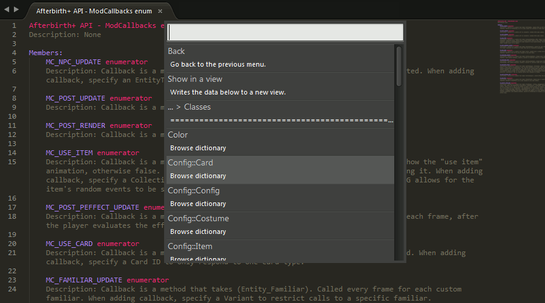

**The Subliming of Isaac**
==

A Sublime Text 2 and 3 package for Lua scripting in *The Binding of Isaac: Afterbirth+* mods.

# **Contents**
- [Description](#description)
- [How to install](#how-to-install)
- [Features](#features)
- [Settings](#settings)
- [Reporting issues](#reporting-issues)
- [Changelog](#changelog)
- [License](#license)

## **Description**
This is a [*Sublime Text*](https://www.sublimetext.com/) *2* and *3* package that aims to provide a variety of features that are relevant to writing scripts for [*The Binding of Isaac: Afterbirth+*](http://bindingofisaac.com/) mods.



## **How to install**

### **Manually**
- Download a [release](https://github.com/Kapiainen/The-Subliming-Of-Isaac/releases).
- Start *Sublime Text*.
- Go to ***Preferences > Browse packages...*** in *Sublime Text*'s toolbar.
- The **\Sublime Text N\Data\Packages** directory should open up.
- Go to the **\Sublime Text N\Data\Installed Packages** directory.
- Copy the **.sublime-package** file(s) from the release archive and paste it into the **\Sublime Text N\Data\Installed Packages** directory.
- Restart Sublime Text.

### **First time setup**
- Go to ***Preferences > Package Settings > The Subliming of Isaac*** in *Sublime Text*'s toolbar.
- Click on ***Settings - Default*** and copy the contents of the file that was opened.
- Go back to ***Preferences > Package Settings > The Subliming of Isaac*** in *Sublime Text*'s toolbar.
- Click on ***Settings - User*** and paste the contents into this file.
- Change the values of settings to your needs/likings in ***Settings - User*** and save the file.

## **Features**
Some features may not be available in Sublime Text 2 or in older versions of Sublime Text 3 due to limitations in the API of those versions of Sublime Text.

### **Completions**
Run the ***Scrape documentation*** command, which can be found in the ***command palette*** (CTRL+SHIFT+P on Windows) of *Sublime Text*, to process the official Lua documentation included in *The Binding of Isaac: Afterbirth+*. You now have access to completions for e.g. public member functions and attributes of classes. The completions include fields, which can be cycled between, for any function parameters that may be defined in the function signature. Some useful information is also included in the completion descriptions (e.g. whether the completion is for a function or an attribute, the return type of a function). The syntax that completions are generated for ("source.lua" by default) can be specified with the ***completions_scope*** setting.

***Context-sensitive completions***

These completions are generated at runtime from information scraped from the Afterbirth+ API. These completions are suggested usually only suggested in the proper context by utilizing the linter. Sometimes it is not possible to figure out the context due to limitations in the linter and completions may be suggested in a context-insensitive manner. Using type annotations, which are described in the section about linting, will help with the accuracy of the context-sensitive completion system. Context-sensitive completions can also show information about function parameters while entering arguments (ST3 only). Context-sensitive completions can be toggled in the settings and require the linter to also be enabled. 

***Static completions***

These completions are generated when scraping the Afterbirth+ API. Static completions almost always include information on the source (e.g. class, namespace) of where the completion is from. These completions are suggested all the time regardless of context provided that context-sensitive completions are not enabled.

### **Linting**
The linter is quite forgiving in some circumstances due to Lua being dynamically typed and in order to serve as a foundation upon which to build a system that provides context-sensitive completions. Fortunately the documentation for the Afterbirth+ Lua API provides types, e.g. for function return types, which is used to check if a variable has access to e.g. specific class attributes and/or functions. The linter should catch lexical and syntactic errors, but some semantic errors may not be possible to catch before the Lua script is executed in the game. Errors found by the linter can be highlighted (anytime in ST3, only when saving in ST2).

Support for some optional type annotations, which are implemented as special Lua-style comments, has been added to the linter with the following syntax:

```
--@[variable_type{, variable_type}][ -> return_type]
```

Brackets indicate optional elements and curly braces/brackets indicate elements that are repeated 0 or more times. Whitespace is optional.

Using type annotations enforces certain semantic checks (e.g. does a class instance have the specified attribute or function) and helps with the accuracy of context-sensitive completions.

**Examples**

A function that returns a boolean could be annotated as follows:

```
function a_function() --@-> boolean
    --function body
end
```

A function with Entity and Color parameters could be annotated as follows:

```
function another_function(ent, col) --@Entity, Color
    --function body
end
```

A function with an EntityPtr parameter and a CollectibleType return value could be annotated as follows:

```
function yet_another_function(e_ptr) --@EntityPtr -> CollectibleType
    --function body
end
```

Most other variable declarations (e.g. local, global, generic for-loop) can also be annotated.
```
a_global_variable = SomeFunction() --@EntityFamiliar

local a_local_variable = SomeOtherFunction() --@GridEntity

for r, v in ipairs(some_table) do --@Room, Vector
    --for-loop body
end
```

The parser is based on a JavaScript library called [luaparse](https://github.com/oxyc/luaparse) that has been ported to Python and modified to make it possible to use it to implement context-sensitive completions. The license can be found in the ***Source*** folder.

### **Documentation browsing**
Information scraped from the official Lua documentation can be browsed and viewed within *Sublime Text* by running the ***Browse documentation*** command. The aforementioned command allows one to browse through the scraped information via *Sublime Text*'s quick panel. Certain information (e.g. all classes with their functions and attributes, a single class' functions and attributes, an enums' members) can also be outputted to a read-only view with syntax highlighting. A new menu entry will show at the top of the quick panel when it is possible to also show information in a view.

The ***Scrape documentation*** command will have to be executed whenever there are updates to the documentation and sometimes when this package is updated. Some changes to the documentation may also require updating of this package to keep up support.

## **Settings**
The available settings can be found in ***Preferences > Package Settings > The Subliming of Isaac*** in *Sublime Text*'s toolbar. More information about each setting can be found in the default settings.

## **Reporting issues**
If you find an issue (e.g. something stops working or is behaving oddly), then please open up a new issue on the [GitHub repository](https://github.com/Kapiainen/The-Subliming-Of-Isaac/issues) and include the following information:
- Operating system.
- Sublime Text version.
- The Subliming of Isaac version.
- Any error messages that pop up on the screen or can be found in Sublime Text's console (***View > Show Console*** in Sublime Text's toolbar).
- A description of what you did when the issue arose. A detailed set of instructions to reproduce the issue would be ideal.

## **Changelog**
**Version 1.5.1 - 2017/03/26:**
- Updated API scraper to look for the renamed file containing documentation regarding enums.
- Fixed a bug in the linter that could cause it to crash.

**Version 1.5.0 - 2017/02/15:**
- Updated linter to handle statements that span multiple lines.
- Fixed bug that enabled references in cached scopes to be modifiable by the parser.
- Significant performance improvements to deep copying of scopes.
- Fixed comment block implementation in the lexer.
- Implemented implicit declaration of 'self' variable when declaring method with ':' operator.
- Fixed bug that could cause the linter to crash.

**Version 1.4.0 - 2017/01/20:**
- Overhaul of the linter and context-sensitive completion systems.
    - Switched from 'dict' instances to instances of classes that represent Lua types.
    - Added support for Lua 5.3's standard libraries.
    - Added better support for nested tables.
- Added settings for the appearance of the popup window that shows information about a function:
    - ***popup_background_color***
    - ***popup_body_font_size***
    - ***popup_body_font_color***
    - ***popup_bold_color***
    - ***popup_heading_font_color***
    - ***popup_heading_font_size***
    - ***popup_max_width***
    - ***popup_max_height***

**Version 1.3.1 - 2017/01/13:**
- Temporarily disabled a semantic check that would raise an exception when encountering any name that is not explicitly declared in the current script.
- Fixed typo that could cause the linter to crash.

**Version 1.3.0 - 2017/01/12:**
- Added a system that implements context-sensitive completions and partial linting.
- Added new settings:
    - ***enable_linter***
    - ***linter_delay***
    - ***highlight_linter_errors***
    - ***show_linter_errors_on_save***
    - ***context_completions***
- Updated the API scraping, documentation browsing, and syntax highlighting features to add support for:
    - Functions in the 'Functions' module.
    - Class constructors.
    - Using Sublime Text's 'Goto Symbol' command to browse Afterbirth+ API documentation when displayed in a Sublime Text view.

**Version 1.2.0 - 2017/01/08:**
- Added setting for the scope that the generated completions belong to.
- 'const' and 'static' keywords are now properly handled when scraping attributes and function return types.
- Updated syntax highlighting to support 'const' and 'static' keywords.
- Fixed bug where certain attributes and functions were not added to scraping results.

**Version 1.1.0 - 2017/01/07:**
- Added documentation browsing feature. Includes custom syntax highlighting (Sublime Text 3 only for now).
- Updated documentation in settings file.
- Fixed function parameter scraping.
- Fixed exemption of scraping certain class documentation files.

**Version 1.0.0 - 2017/01/04:**
- Initial release.

## **License**
See [**LICENSE.md**](LICENSE.md) for more information.

This software includes a modified port of luaparse ([repository](https://github.com/oxyc/luaparse), [license](/Source/luaparse-LICENSE)) and official Lua documentation ([website](https://www.lua.org/manual/5.3/manual.html), [license](/Source/lua-LICENSE))
